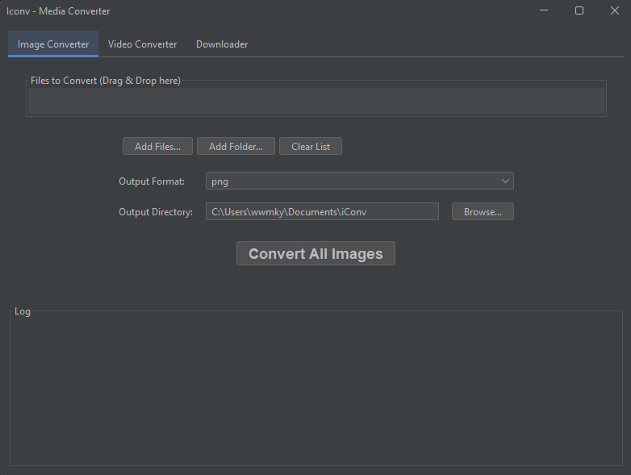

# iConv - The Ultimate Media Converter

iConv is a versatile and user-friendly desktop application for all your media conversion and downloading needs. Built with Java Swing, it provides a modern, dark-themed interface to handle images, videos, and online content from popular platforms.



## Features

- **Image Conversion**: 
  - Convert between a wide variety of image formats (PNG, JPG, BMP, GIF, and more).
  - Batch convert multiple images at once.
  - Drag-and-drop support for files and folders.
  - Automatically preserves folder structure in the output directory.
  - Handles transparency correctly (e.g., adds a white background when converting from PNG to JPG).

- **Video Conversion**:
  - Convert videos to popular formats like MP4, MKV, MOV, and AVI.
  - Extract audio from video files into MP3 format.
  - Batch conversion for multiple video files.
  - Drag-and-drop support.

- **Online Video Downloader**:
  - Download videos from YouTube, TikTok, Instagram, and many other websites.
  - Choose your desired video quality (Best, 1080p, 720p, 480p).
  - Option to download audio-only as an MP3 file.
  - Visual progress bar for downloads.

- **User-Friendly Interface**:
  - Modern, dark theme powered by FlatLaf.
  - Intuitive tabbed layout for different functions.
  - Real-time logging of all operations.
  - Automatic opening of the output folder after a task is complete.

- **Automatic Dependency Management**:
  - `yt-dlp` and `ffmpeg` are automatically downloaded on first use, so you don't need to install them manually.

## Getting Started

### Prerequisites

- [Java Development Kit (JDK) 17](https://www.oracle.com/java/technologies/javase/jdk17-archive-downloads.html) or later.
- [Apache Maven](https://maven.apache.org/download.cgi) (for building from source).

### How to Run

1. **Clone the repository**:
   ```bash
   git clone https://github.com/emkacztoja/iConv.git
   cd iConv
   ```

2. **Build the project using Maven**:
   This command will compile the source code and package it into a single, executable JAR file in the `target` directory.
   ```bash
   mvn clean package
   ```

3. **Run the application**:
   ```bash
   java -jar target/iconv-1.0-SNAPSHOT.jar
   ```

The application window should now appear.

## How to Use

### Image & Video Conversion
1. Go to the **Image Converter** or **Video Converter** tab.
2. Drag and drop your files or folders into the list area, or use the "Add Files..." and "Add Folder..." buttons.
3. Select your desired output format from the dropdown menu.
4. Click the **Convert All** button.

The converted files will be saved in your `Documents/iConv` folder, preserving the original directory structure.

### Downloader
1. Go to the **Downloader** tab.
2. Paste the URL of the video you want to download.
3. Select your desired quality.
4. If you only want the audio, check the **Download audio only (MP3)** box.
5. Click the **Download** button.

The downloaded file will be saved in your `Documents/iConv` folder.

## Project Structure

- `pom.xml`: The Maven project configuration file, including all dependencies.
- `src/main/java/com/example/iconv/`: The main package containing all the Java source code.
  - `Main.java`: The entry point of the application.
  - `MainWindow.java`: The main application window and UI logic.
  - `ImageConverter.java`: Handles all image conversion logic.
  - `VideoConverter.java`: Handles video conversion using `ffmpeg`.
  - `Downloader.java`: Manages video downloads using `yt-dlp`.
  - `FfmpegInstaller.java`: Automatically downloads and manages the `ffmpeg` executable.

## Contributing

Contributions are welcome! If you have ideas for new features or improvements, feel free to fork the repository and submit a pull request.

## License

This project is licensed under the MIT License - see the `LICENSE` file for details.
